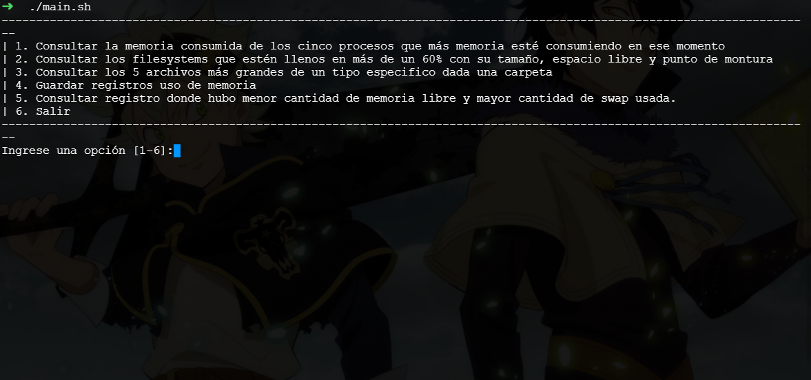

# Sleepy Monitor
Manager of some basic functions for Linux

## Requirements
- Languages: 

## Screenshots

## Usage
1. Clone the Repository.

> git clone https://github.com/KorKux1/final-project-operating-systems.git

2. Enter into the project folder
   
> cd .\final-project-operating-systems\

3. Give execution permissions

> chmod +x main.sh

4. Run the project.

> ./main.sh

5. Enter any of the options to interact with the program

## Setup (Developer Mode)

1. Clone the Repository.

> git clone https://github.com/KorKux1/final-project-operating-systems.git

2. Import The project in your favorite Code Editor.

## Contributors

- Cristhian Castillo (KorKux).
- Sebastián Correa Villada.
- David Obando Gamboa.
- John Camilo Sepulveda Serna.

## License

MIT

---
⌨️ with the ❤
